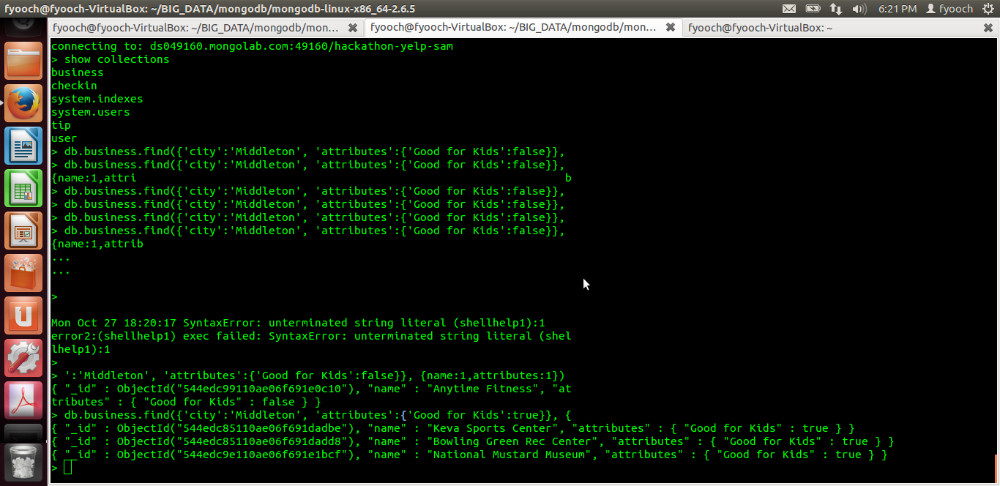

# Team Members

* [Ryan Roden](www.github.com/rodenr)
* [Daniel Nolan](www.github.com/dano8957)
* [Sam Korn](URL to this member's github account)
* [name-of-a-team-member](URL to this member's github account)
* [name-of-a-team-member](URL to this member's github account)

# Objective 1. Ingest

 

# Objective 2. Query

* [Question 1](https://github.com/CSCI-4830-002-2014/hackathon-yelp/issues/19)
* [Question 2](link-to-an-issue)

# Objective 3. Serve

## Question 1

## Question 2

 

# Objective 4. Visualize

## Sketch

 

## D3 Visualization

{{a short explanation of this visualization}}
