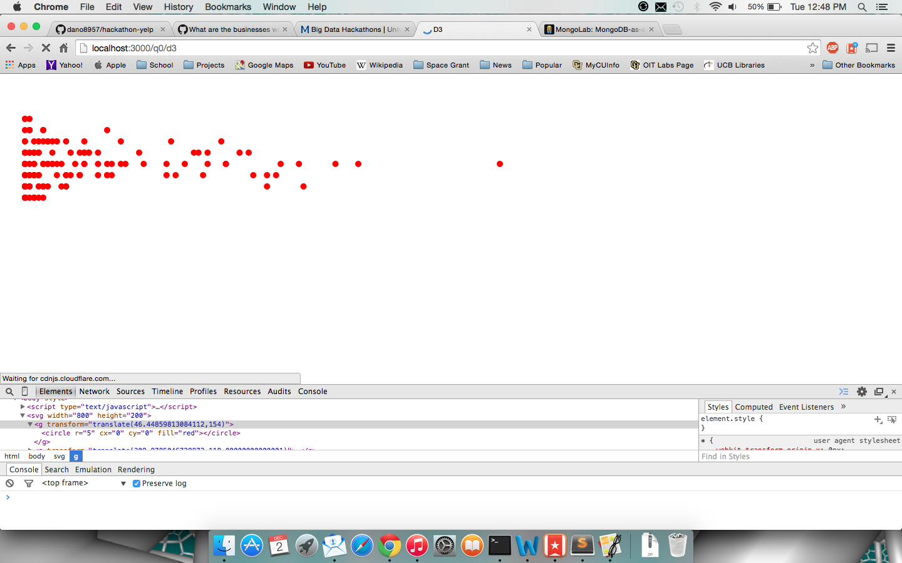
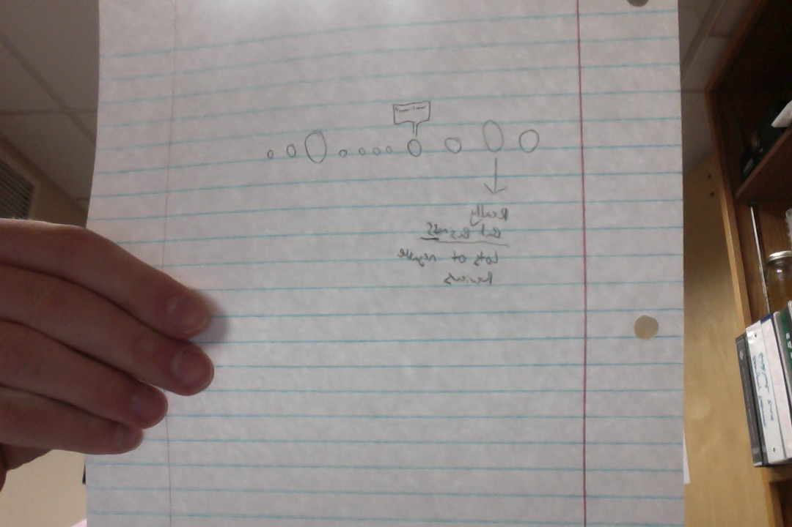

# Team Members

* [Ryan Roden](www.github.com/rodenr)
* [Daniel Nolan](www.github.com/dano8957)
* [Sam Korn](www.github.com/sako0938)
* [name-of-a-team-member](URL to this member's github account)
* [name-of-a-team-member](URL to this member's github account)

# Objective 1. Ingest

 

# Objective 2. Query

* [Question 1](https://github.com/CSCI-4830-002-2014/hackathon-yelp/issues/19)
* [Question 2](link-to-an-issue)

# Objective 3. Serve

## Question 1

## Question 2

 

# Objective 4. Visualize

## Warm-Up

All you need to do is remove the "Good for kids" attribute in order to just show businesses in middleton.

## Sketch

 

## D3 Visualization

This visualization will help users see the worst businesses in Madison, but will help sort out anomaly reviews. Since more reviews negative reviews will indicate that the star rating is more accurate than less reviews.
